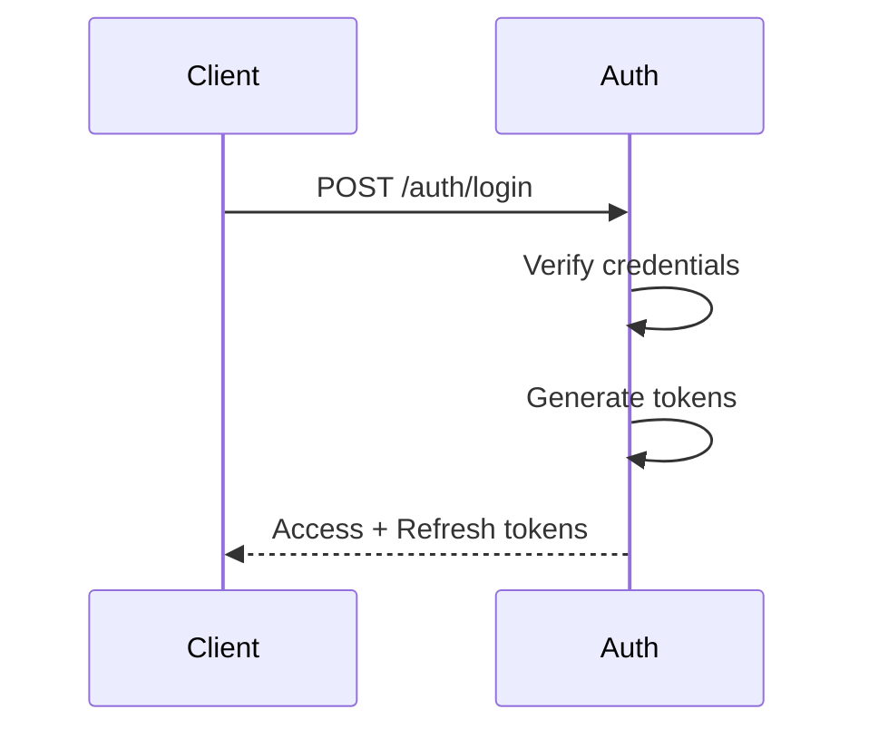
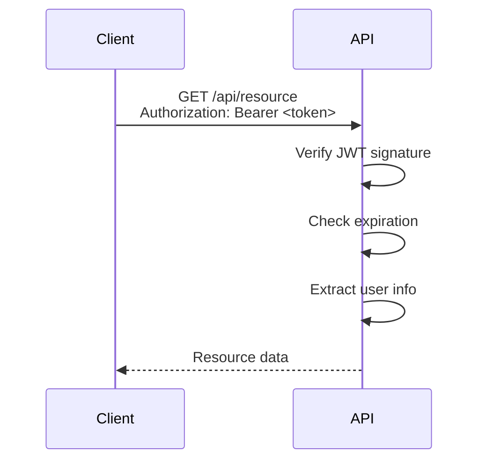
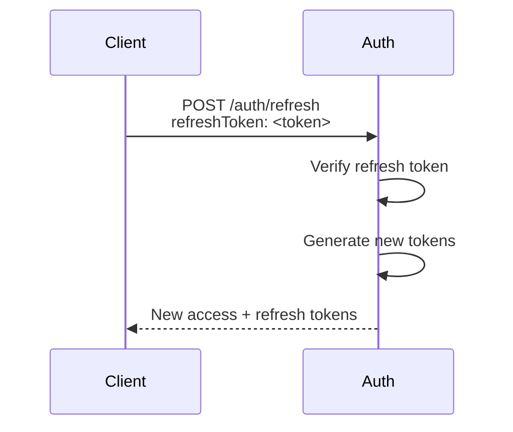

import { Callout } from 'fumadocs-ui/components/callout';

# JWT Tokens

MiniSource uses JSON Web Tokens (JWT) for stateless authentication across services.

## Token Types

### Access Token

- **Lifetime:** 15 minutes (configurable)
- **Purpose:** Authenticate API requests
- **Storage:** Memory or secure storage
- **Transmission:** Authorization header

### Refresh Token

- **Lifetime:** 7 days (configurable)
- **Purpose:** Obtain new access tokens
- **Storage:** Secure HttpOnly cookie or encrypted storage
- **Transmission:** Request body or cookie

## Token Structure

### Access Token Claims

```json
{
  "sub": "550e8400-e29b-41d4-a716-446655440000",
  "email": "user@example.com",
  "roles": ["user"],
  "type": "access",
  "iat": 1705315800,
  "exp": 1705316700
}
```

**Claims:**
- `sub` - Subject (user ID)
- `email` - User's email address
- `roles` - User's roles array
- `type` - Token type (access/refresh)
- `iat` - Issued at timestamp
- `exp` - Expiration timestamp

### Refresh Token Claims

```json
{
  "sub": "550e8400-e29b-41d4-a716-446655440000",
  "type": "refresh",
  "iat": 1705315800,
  "exp": 1705920600
}
```

## Token Lifecycle

### 1. Login & Token Issuance



### 2. Using Access Token



### 3. Token Refresh



## Implementation

### Client-Side Token Storage

**Web Applications:**

```javascript
// Store tokens
localStorage.setItem('accessToken', tokens.accessToken);
localStorage.setItem('refreshToken', tokens.refreshToken);

// Use access token
fetch('/api/resource', {
  headers: {
    'Authorization': `Bearer ${localStorage.getItem('accessToken')}`
  }
});
```

**Mobile Applications:**

```swift
// iOS - Keychain
let keychain = Keychain(service: "com.minisource.app")
keychain["accessToken"] = tokens.accessToken
keychain["refreshToken"] = tokens.refreshToken
```

### Automatic Token Refresh

```javascript
class AuthService {
  async refreshTokenIfNeeded() {
    const token = this.getAccessToken();
    const decoded = jwt_decode(token);
    const now = Date.now() / 1000;
    
    // Refresh if expires in less than 5 minutes
    if (decoded.exp - now < 300) {
      const newTokens = await this.refreshToken();
      this.saveTokens(newTokens);
      return newTokens.accessToken;
    }
    
    return token;
  }
  
  async makeRequest(url, options = {}) {
    const token = await this.refreshTokenIfNeeded();
    
    return fetch(url, {
      ...options,
      headers: {
        ...options.headers,
        'Authorization': `Bearer ${token}`
      }
    });
  }
}
```

## Security Best Practices

<Callout type="warning">
  **Never** store tokens in localStorage on web applications if XSS attacks are a concern. Use HttpOnly cookies or secure in-memory storage.
</Callout>

### Token Security Guidelines

1. **Use HTTPS Only**
   - Always transmit tokens over encrypted connections

2. **Short Access Token Lifetime**
   - Keep access tokens short-lived (15-30 minutes)
   - Use refresh tokens for longer sessions

3. **Secure Storage**
   - Web: HttpOnly cookies or secure memory
   - Mobile: Keychain (iOS) / Keystore (Android)
   - Never log tokens

4. **Token Rotation**
   - Issue new refresh token on each refresh
   - Invalidate old refresh tokens

5. **Revocation**
   - Maintain token blacklist for compromised tokens
   - Revoke all tokens on password change

## Token Validation

### Server-Side Validation

```go
func ValidateToken(tokenString string) (*Claims, error) {
    token, err := jwt.ParseWithClaims(
        tokenString,
        &Claims{},
        func(token *jwt.Token) (interface{}, error) {
            return []byte(jwtSecret), nil
        },
    )
    
    if err != nil {
        return nil, err
    }
    
    if claims, ok := token.Claims.(*Claims); ok && token.Valid {
        // Check token type
        if claims.Type != "access" {
            return nil, errors.New("invalid token type")
        }
        
        // Check expiration
        if time.Now().Unix() > claims.ExpiresAt {
            return nil, errors.New("token expired")
        }
        
        return claims, nil
    }
    
    return nil, errors.New("invalid token")
}
```

## Common Issues

### Token Expired

**Problem:** `401 Unauthorized - Token expired`

**Solution:** Use refresh token to get new access token

```javascript
try {
  const response = await fetch('/api/resource', {
    headers: { 'Authorization': `Bearer ${accessToken}` }
  });
} catch (error) {
  if (error.status === 401) {
    // Refresh token
    const newTokens = await refreshToken();
    // Retry request
  }
}
```

### Invalid Signature

**Problem:** `401 Unauthorized - Invalid token signature`

**Causes:**
- JWT_SECRET mismatch between services
- Token tampered with
- Token from different environment

**Solution:** Verify JWT_SECRET is consistent across all services

### Clock Skew

**Problem:** Token validation fails due to time differences

**Solution:** Allow small time tolerance (5 seconds) in validation

```go
parser := jwt.Parser{ValidMethods: []string{"HS256"}}
parser.SkipClaimsValidation = false
parser.UseJSONNumber = true
parser.AllowedClockSkew = 5 * time.Second
```

## Next Steps

- Learn about [Role-Based Access Control](/docs/auth/rbac)
- Explore [Session Management](/docs/auth/sessions)
- See [Security Best Practices](/docs/auth/security)